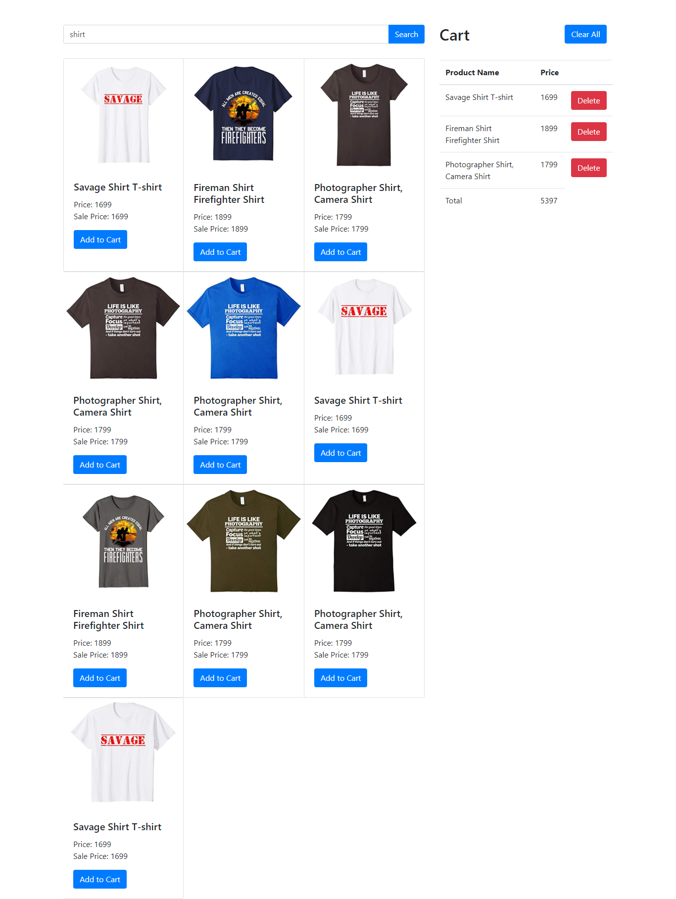

# Shopping Cart

**live sample of this app:** [reactjs-shopping-cart](https://reactjs-shopping-cart.netlify.com/)

# Technologies used:
- ReactJS
- Bootstrap for ui component
- Fetch API for data fetching

# Objectives
It's an inspirational project. In this project, i learn how to fetch data from external API and integrate into app.
It's a like playground to play with react's state and props.

 
